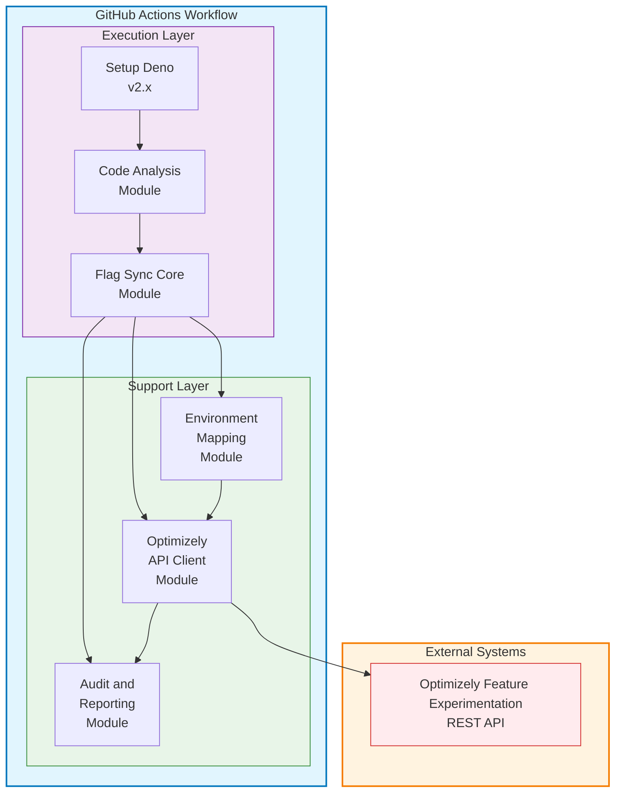

# Technical Design Document: Feature Flag Synchronization Solution

## Executive Summary

This Technical Design Document outlines the implementation of a GitHub Actions-based feature flag synchronization solution using Deno 2 and TypeScript. The solution addresses automated cleanup of unused feature flags and promotion of feature flags across Optimizely environments during software development lifecycle phases.

### Key Technical Decisions

- **Runtime**: Deno 2 for secure, modern TypeScript execution
- **CI/CD Platform**: GitHub Actions for seamless repository integration
- **Language**: TypeScript for type safety and developer experience
- **Architecture**: Modular script-based approach for maintainability and testability

## Architecture Overview

### High-Level Architecture



### Component Overview

1. **GitHub Actions Workflow**: Orchestrates execution across different trigger events
2. **Code Analysis Module**: Scans repository for feature flag references
3. **Flag Sync Core Module**: Manages feature flag lifecycle operations
4. **Environment Mapping Module**: Handles environment-specific configurations
5. **Optimizely API Client**: Manages all API interactions with rate limiting and retries
6. **Audit and Reporting Module**: Provides comprehensive logging and reporting

## Project Structure and Dependencies

```
src/
├── main.ts                    # Entry point and CLI handling
├── config/
│   ├── flag-sync-config.ts   # Configuration interfaces and defaults
│   └── environment.ts        # Environment variable loading
├── modules/
│   ├── code-analysis.ts      # Repository scanning and flag extraction
│   ├── flag-sync-core.ts     # Core synchronization logic
│   ├── environment-mapping.ts # Environment configuration management
│   ├── optimizely-client.ts  # Optimizely API client with rate limiting
│   ├── audit-reporter.ts     # Audit logging and reporting
│   └── security.ts           # Security utilities and validation
├── types/
│   ├── optimizely.ts         # Optimizely API response types
│   ├── sync.ts               # Synchronization data types
│   └── config.ts             # Configuration types
├── utils/
│   ├── logger.ts             # Structured logging utilities
│   ├── retry.ts              # Retry logic with exponential backoff
│   └── validation.ts         # Input validation utilities
└── __tests__/
    ├── integration/          # Integration tests
    ├── unit/                # Unit tests
    └── fixtures/            # Test data and mocks
```

## Technical Requirements

### Runtime Environment

- **Deno**: Version 2.x (latest stable)
- **TypeScript**: Version 5.x (bundled with Deno)
- **GitHub Actions**: Ubuntu 22.04 LTS runner

### External APIs

- **Optimizely Feature Experimentation REST API**: v2
- **GitHub REST API**: v2022-11-28 (for repository access)

## System Design

### Core Modules

#### 1. Code Analysis Module (`src/modules/code-analysis.ts`)

**Purpose**: Analyze repository code to identify feature flag references

**Key Functions**:
- `scanRepository()`: Recursively scan source files for feature flag references
- `extractFeatureFlags()`: Extract flag references using configurable language patterns
- `compareWithPrevious()`: Identify flag additions/removals since last scan
- `generateFlagReport()`: Create comprehensive flag usage report
- `validateFlagReferences()`: Validate flag reference syntax and patterns

**Supported Languages**: JavaScript, TypeScript, Python, Java, C#, Go, PHP

#### 2. Flag Sync Core Module (`src/modules/flag-sync-core.ts`)

**Purpose**: Manage feature flag lifecycle operations

**Key Functions**:
- `createSyncPlan()`: Analyze differences and create execution plan
- `syncFlagsToEnvironment()`: Synchronize flags between environments
- `archiveUnusedFlags()`: Archive flags no longer referenced in code
- `createMissingFlags()`: Create flags found in code but missing in Optimizely
- `validateFlagConsistency()`: Ensure consistency across environments
- `executeSyncPlan()`: Execute the planned synchronization operations

#### 3. Environment Mapping Module (`src/modules/environment-mapping.ts`)

**Purpose**: Handle environment-specific configurations and mappings

**Key Functions**:
- `loadEnvironmentConfig()`: Load configuration from file system
- `mapDeploymentToOptimizely()`: Map deployment environments to Optimizely environments
- `getPromotionChain()`: Retrieve environment promotion hierarchy
- `validateEnvironmentMapping()`: Validate configuration consistency
- `getEnvironmentSettings()`: Get environment-specific settings

#### 4. Optimizely API Client (`src/modules/optimizely-client.ts`)

**Purpose**: Manage all interactions with Optimizely APIs with enterprise-grade reliability

**Key Features**:
- Rate limiting and retry logic with exponential backoff
- Authentication management and token validation
- Request batching for performance optimization
- Comprehensive error handling and graceful degradation
- API response validation and type safety
- Audit logging for all API operations

**Key Functions**:
- `getFeatureFlags()`: Fetch all feature flags for a project
- `getFlagDetails()`: Get detailed information for a specific flag
- `batchGetFlagDetails()`: Batch fetch flag details with controlled concurrency
- `createFeatureFlag()`: Create a new feature flag with validation
- `updateFeatureFlag()`: Update existing feature flag configuration
- `archiveFeatureFlag()`: Archive (soft delete) a feature flag
- `getEnvironments()`: Retrieve all environments for a project
- `validateToken()`: Validate API token and permissions
- `getApiUsage()`: Get current API usage statistics

### Data Models

Core data structures for feature flag synchronization and code analysis.

## Implementation Details

### GitHub Actions Workflow Structure

```yaml
# .github/workflows/feature-flag-sync.yml
name: Feature Flag Synchronization

on:
  push:
    branches: [main, develop, staging]
  pull_request:
    branches: [main, develop, staging]
  schedule:
    - cron: '0 6 * * 1'  # Weekly cleanup on Mondays
  workflow_dispatch:
    inputs:
      environment:
        description: 'Target environment'
        required: true
        type: choice
        options: ['dev', 'staging', 'production']
      operation:
        description: 'Operation type'
        required: true
        type: choice
        options: ['sync', 'cleanup', 'audit']
      dry_run:
        description: 'Dry run mode'
        required: false
        type: boolean
        default: true

jobs:
  feature-flag-sync:
    runs-on: ubuntu-latest
    timeout-minutes: 15
    
    steps:
      - name: Checkout Repository
        uses: actions/checkout@v4
      
      - name: Setup Deno
        uses: denoland/setup-deno@v2
        with:
          deno-version: v2.x
      
      - name: Cache Dependencies
        uses: actions/cache@v3
        with:
          path: ~/.cache/deno
          key: deno-${{ hashFiles('deno.json', 'deno.lock') }}
          restore-keys: deno-
      
      - name: Validate Configuration
        run: deno run --allow-read src/validate-config.ts
      
      - name: Execute Feature Flag Sync
        run: deno run --allow-all src/main.ts
        env:
          OPTIMIZELY_API_TOKEN: ${{ secrets.OPTIMIZELY_API_TOKEN }}
          OPTIMIZELY_PROJECT_ID: ${{ secrets.OPTIMIZELY_PROJECT_ID }}
          GITHUB_TOKEN: ${{ secrets.GITHUB_TOKEN }}
          ENVIRONMENT: ${{ github.event.inputs.environment || 'auto' }}
          OPERATION: ${{ github.event.inputs.operation || 'sync' }}
          DRY_RUN: ${{ github.event.inputs.dry_run || 'true' }}
      
      - name: Upload Sync Report
        uses: actions/upload-artifact@v3
        if: always()
        with:
          name: flag-sync-report-${{ github.run_number }}
          path: reports/
          retention-days: 30
      
      - name: Comment on PR
        uses: actions/github-script@v7
        if: github.event_name == 'pull_request'
        with:
          script: |
            const fs = require('fs');
            const reportPath = 'reports/pr-summary.md';
            if (fs.existsSync(reportPath)) {
              const report = fs.readFileSync(reportPath, 'utf8');
              github.rest.issues.createComment({
                issue_number: context.issue.number,
                owner: context.repo.owner,
                repo: context.repo.repo,
                body: report
              });
            }
```

### Main Entry Point (`src/main.ts`)

**Purpose**: Orchestrate the entire feature flag synchronization process

**Key Functions**:
- `main()`: Entry point with error handling and logging
- `parseCommandLineArgs()`: Parse CLI arguments and environment variables
- `validateConfiguration()`: Validate configuration files and environment setup
- `initializeComponents()`: Initialize all required modules and clients
- `createSyncPlan()`: Generate synchronization plan based on analysis
- `executeSyncPlan()`: Execute the synchronization operations
- `generateReport()`: Create comprehensive audit and summary reports

### Configuration Management

Centralized configuration for all aspects of the feature flag synchronization system.

## Security Considerations

### Authentication and Authorization

1. **API Token Management**:
   - Store Optimizely API tokens as GitHub repository secrets
   - Use service account with minimal required permissions
   - Implement token rotation procedures

2. **Permission Scoping**:
   - Limit GitHub Actions permissions to minimum required
   - Use `GITHUB_TOKEN` with appropriate scopes
   - Implement environment-specific permission models

3. **Audit Trail**:
   - Log all API calls with timestamps and user context
   - Maintain immutable audit logs
   - Export audit data for compliance reporting as an artifact available in the GitHub Action run summary

### Data Protection

**Key Functions**:
- `sanitizeData()`: Remove sensitive data from logs and reports
- `validateApiToken()`: Validate API token format and permissions
- `encryptSecrets()`: Encrypt sensitive configuration data
- `auditSecurityEvents()`: Log security-related events

## Monitoring and Observability

### Metrics Collection

Comprehensive metrics tracking for monitoring synchronization performance and operational health.

### Alerting Strategy

1. **Success Metrics**: Track successful synchronizations
2. **Error Thresholds**: Alert on API failure rates > 5%
3. **Performance Monitoring**: Alert on execution time > 5 minutes
4. **Compliance Alerts**: Notify on unauthorized flag modifications

## Performance Considerations

### Optimization Strategies

1. **Parallel Processing**: Process multiple flags concurrently
   - Configurable concurrency limits to avoid API throttling default to 5 concurrent requests
   - Use Deno's async capabilities to handle multiple API calls in parallel
   - Limit concurrency to avoid overwhelming the Optimizely API
2. **Searching**: Use native git commands for efficient file searching
3. **Dependency Management**: Use Deno's built-in functions instead of external libraries to minimize dependencies and improve performance

**LEGAL NOTICE**: This document and all artifacts related to and including a final deployed solution are for illustrative purposes and are not officially supported by Optimizely nor any other entity. The solution is a conceptual framework designed to illustrate the potential benefits and implementation strategies for automated feature flag management.
