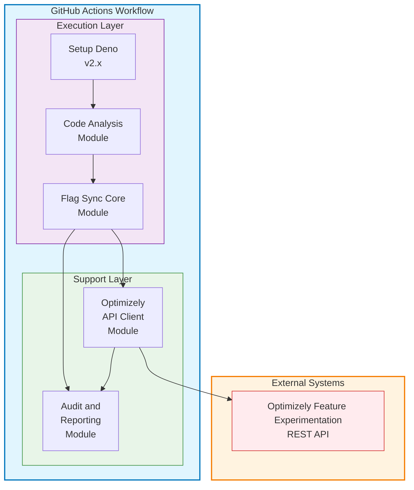
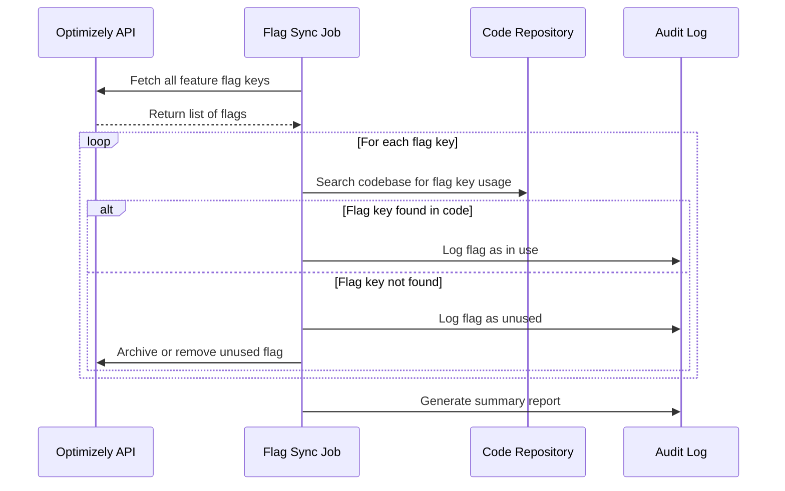

# Technical Design Document: Feature Flag Synchronization GitHub Action

## Executive Summary

This Technical Design Document outlines the implementation of a **GitHub Marketplace Action** for feature flag synchronization using Deno 2 and TypeScript. This Action will be published to the GitHub Marketplace for consumption by other repositories, providing automated cleanup of unused feature flags to prevent feature flag debt and maintain clean Optimizely configurations.

### Key Technical Decisions

- **Product Type**: GitHub Marketplace Action (composite action) for broad ecosystem adoption
- **Runtime**: Deno 2 for secure, modern TypeScript execution within the action
- **Distribution**: GitHub Marketplace for easy consumption via `uses: optimizely/feature-flag-sync-action@v1`
- **Language**: TypeScript for type safety and developer experience
- **Architecture**: Composite action with modular TypeScript core for maintainability and testability
- **Consumer Integration**: Workflows use the action via standard GitHub Actions syntax with inputs
- **Flag Cleanup Strategy**: Prioritize Optimizely-first approach for identifying and removing unused flags (see "Flag Cleanup Strategy" below)

## Architecture Overview

### High-Level Architecture



### Component Overview

1. **GitHub Marketplace Action** (`action.yml`): Composite action definition with inputs, outputs, and orchestrated steps
2. **Code Analysis Module**: Scans consumer repository for feature flag references
3. **Flag Sync Core Module**: Manages feature flag lifecycle operations
4. **Optimizely API Client**: Manages all API interactions with rate limiting and retries
5. **Audit and Reporting Module**: Provides comprehensive logging, reporting, and PR commenting
6. **Consumer Workflows**: Client repositories consume the action via `uses: optimizely/feature-flag-sync-action@v1`

## Project Structure and Dependencies

```
src/
├── main.ts                    # Entry point and CLI handling
├── config/
│   ├── flag-sync-config.ts   # Configuration interfaces and defaults
│   ├── environment.ts        # Environment variable loading
│   └── environment.test.ts   # Environment configuration tests
├── modules/
│   ├── code-analysis.ts      # Repository scanning and flag extraction
│   ├── code-analysis.test.ts # Code analysis unit tests
│   ├── flag-sync-core.ts     # Core synchronization logic
│   ├── optimizely-client.ts  # Optimizely API client with rate limiting
│   ├── optimizely-client.test.ts # API client unit tests
│   ├── audit-reporter.ts     # Audit logging and reporting
│   ├── audit-reporter.test.ts # Audit reporter unit tests
│   ├── compliance-reporter.ts # Compliance reporting functionality
│   ├── compliance-reporter.test.ts # Compliance reporter unit tests
│   ├── flag-usage-reporter.ts # Flag usage reporting functionality
│   ├── flag-usage-reporter.test.ts # Flag usage reporter unit tests
│   ├── security.ts           # Security utilities and validation
│   └── security.test.ts      # Security utilities unit tests
├── types/
│   ├── optimizely.ts         # Optimizely API response types
│   ├── sync.ts               # Synchronization data types
│   └── config.ts             # Configuration types
└── utils/
    ├── logger.ts             # Structured logging utilities
    ├── retry.ts              # Retry logic with exponential backoff
    ├── try-catch.ts          # Error handling utilities
    ├── validation.ts         # Input validation utilities
    └── validation.test.ts    # Validation utilities unit tests
```

## Technical Requirements

### Runtime Environment

- **Deno**: Version 2.x (latest stable)
- **TypeScript**: Version 5.x (bundled with Deno)
- **GitHub Actions**: Ubuntu latest

### External APIs

- **Optimizely Feature Experimentation REST API**: v2

## System Design

### Core Modules

#### 1. Code Analysis Module (`src/modules/code-analysis.ts`)

**Purpose**: Analyze repository code to identify feature flag references

**Key Functions**:
- `scanRepository()`: Recursively scan source files for feature flag references
- `extractFeatureFlags()`: Extract flag references using configurable language patterns
- `compareWithPrevious()`: Identify flag additions/removals since last scan
- `generateFlagReport()`: Create comprehensive flag usage report
- `validateFlagReferences()`: Validate flag reference syntax and patterns

**Supported Languages**: JavaScript, TypeScript, Python, Java, C#, Go, PHP

#### 2. Flag Sync Core Module (`src/modules/flag-sync-core.ts`)

**Purpose**: Manage feature flag lifecycle operations

**Key Functions**:
- `createSyncPlan()`: Analyze differences and create execution plan
- `archiveUnusedFlags()`: Archive flags no longer referenced in code
- `validateFlagConsistency()`: Ensure consistency between code and Optimizely
- `executeSyncPlan()`: Execute the planned synchronization operations

#### 3. Optimizely API Client (`src/modules/optimizely-client.ts`)

**Purpose**: Manage all interactions with Optimizely APIs with enterprise-grade reliability

**API Examples**: See [example-api-requests-responses.md](dev-artifacts/example-api-requests-responses.md) for detailed API request/response patterns and error handling scenarios.

**Key Features**:
- Rate limiting and retry logic with exponential backoff
- Authentication management and token validation
- Request batching for performance optimization
- Comprehensive error handling and graceful degradation
- API response validation and type safety
- Audit logging for all API operations

**Key Functions**:
- `getFeatureFlags()`: Fetch all feature flags for a project
- `getFlagDetails()`: Get detailed information for a specific flag
- `batchGetFlagDetails()`: Batch fetch flag details with controlled concurrency
- `archiveFeatureFlag()`: Archive (soft delete) a feature flag
- `getEnvironments()`: Retrieve all environments for a project
- `validateToken()`: Validate API token and permissions
- `getApiUsage()`: Get current API usage statistics

### Data Models

Core data structures for feature flag synchronization and code analysis.

## Implementation Details

### GitHub Actions Workflow Example

**Consumer Integration**: See [example-workflow.yml](dev-artifacts/example-workflow.yml) for how clients would integrate this Action into their repositories.

**Internal Development**: See [feature-flag-sync.yml](dev-artifacts/feature-flag-sync.yml) for development and testing workflow patterns.

```yaml
# .github/workflows/feature-flag-sync.yml
name: Feature Flag Synchronization

on:
  push:
    branches: [main]
  pull_request:
    branches: [main]
  workflow_dispatch:
    inputs:
      operation:
        description: 'Operation type'
        required: true
        type: choice
        options: ['cleanup', 'audit']
      dry_run:
        description: 'Dry run mode'
        required: false
        type: boolean
        default: true

jobs:
  feature-flag-sync:
    runs-on: ubuntu-latest
    timeout-minutes: 15
    
    steps:
      - name: Checkout Repository
        uses: actions/checkout@v4
      
      - name: Setup Deno
        uses: denoland/setup-deno@v2
        with:
          deno-version: v2.x
      
      - name: Validate Configuration
        run: deno run --allow-read src/validate-config.ts
      
      - name: Execute Feature Flag Cleanup
        run: deno run --allow-all src/main.ts
        env:
          OPTIMIZELY_API_TOKEN: ${{ secrets.OPTIMIZELY_API_TOKEN }}
          OPTIMIZELY_PROJECT_ID: ${{ secrets.OPTIMIZELY_PROJECT_ID }}
          GITHUB_TOKEN: ${{ secrets.GITHUB_TOKEN }}
          OPERATION: ${{ github.event.inputs.operation || 'cleanup' }}
          DRY_RUN: ${{ github.event.inputs.dry_run || 'true' }}
      
      - name: Upload Sync Report
        uses: actions/upload-artifact@v3
        if: always()
        with:
          name: flag-sync-report-${{ github.run_number }}
          path: reports/
          retention-days: 30
      
      - name: Comment on PR
        uses: actions/github-script@v7
        if: github.event_name == 'pull_request'
        with:
          script: |
            const fs = require('fs');
            const reportPath = 'reports/pr-summary.md';
            if (fs.existsSync(reportPath)) {
              const report = fs.readFileSync(reportPath, 'utf8');
              github.rest.issues.createComment({
                issue_number: context.issue.number,
                owner: context.repo.owner,
                repo: context.repo.repo,
                body: report
              });
            }
```

### Main Entry Point (`src/main.ts`)

**Purpose**: Orchestrate the entire feature flag cleanup process

**Key Functions**:
- `main()`: Entry point with error handling and logging
- `parseCommandLineArgs()`: Parse CLI arguments and environment variables
- `validateConfiguration()`: Validate configuration files and environment setup
- `initializeComponents()`: Initialize all required modules and clients
- `createCleanupPlan()`: Generate cleanup plan based on code analysis
- `executeCleanupPlan()`: Execute the cleanup operations
- `generateReport()`: Create comprehensive audit and summary reports

### Configuration Management

Centralized configuration for all aspects of the feature flag cleanup system.

## Security Considerations

### Authentication and Authorization

1. **API Token Management**:
   - Store Optimizely API tokens as GitHub repository secrets
   - Use service account with minimal required permissions
   - Implement token rotation procedures

2. **Permission Scoping**:
   - Limit GitHub Actions permissions to minimum required
   - Use `GITHUB_TOKEN` with appropriate scopes
   - Implement environment-specific permission models

3. **Audit Trail**:
   - Log all API calls with timestamps and user context
   - Maintain immutable audit logs
   - Export audit data for compliance reporting as an artifact available in the GitHub Action run summary

### Data Protection

**Key Functions**:
- `sanitizeData()`: Remove sensitive data from logs and reports
- `validateApiToken()`: Validate API token format and permissions
- `encryptSecrets()`: Encrypt sensitive configuration data
- `auditSecurityEvents()`: Log security-related events

## Monitoring and Observability

### Metrics Collection

Comprehensive metrics tracking for monitoring synchronization performance and operational health.

### Alerting Strategy

1. **Success Metrics**: Track successful synchronizations
2. **Error Thresholds**: Alert on API failure rates > 5%
3. **Performance Monitoring**: Alert on execution time > 5 minutes
4. **Compliance Alerts**: Notify on unauthorized flag modifications

## Performance Considerations

### Optimization Strategies

1. **Parallel Processing**: Process multiple flags concurrently
   - Configurable concurrency limits to avoid API throttling default to 5 concurrent requests
   - Use Deno's async capabilities to handle multiple API calls in parallel
   - Limit concurrency to avoid overwhelming the Optimizely API
2. **Searching**: Use native git commands for efficient file searching
3. **Dependency Management**: Use Deno's built-in functions instead of external libraries to minimize dependencies and improve performance

## Flag Cleanup Strategy



### Prioritization: Optimizely-First Approach

To ensure a lean and accurate Optimizely configuration, this solution prioritizes an **Optimizely-first strategy** for feature flag cleanup. The primary goal is to identify and archive or remove flags that exist in Optimizely but are no longer referenced in the codebase.

#### Rationale
- **Directly targets flag debt**: By starting with the list of all flags in Optimizely, the system can systematically check which ones are no longer referenced in the codebase and safely archive or remove them.
- **Reduces configuration bloat**: Ensures that only flags actively used in code remain in Optimizely, minimizing clutter and potential confusion.
- **Minimizes risk of missed orphans**: No flags that are still present in Optimizely but have been removed from code will be missed.
- **Aligns with business priorities**: The organization is less concerned about new flags being added to code before Optimizely setup, and more concerned with cleaning up unused flags.

#### Implementation Steps
1. **Fetch all feature flag keys from Optimizely** (via API).
2. **Search the codebase for each flag key** (string search, with context-aware filtering to avoid false positives from comments/tests).
3. **Report or archive flags not found in code** (with audit logging for compliance).

#### Additional Considerations
- **False positives**: Code search should exclude comments, test fixtures, and documentation to avoid mistakenly keeping unused flags.
- **Dynamic usage**: If the codebase uses dynamic flag keys, developer guidelines or code annotations should be used to help the tool catch these cases.
- **Audit and reporting**: All archival actions should be logged and reported for compliance and review.

## Distribution and Packaging

**Marketplace Strategy**: See [packaging-strategy.md](dev-artifacts/packaging-strategy.md) for detailed information about GitHub Marketplace distribution, versioning, and release management.

**LEGAL NOTICE**: This document and all artifacts related to and including a final deployed solution are for illustrative purposes and are not officially supported by Optimizely nor any other entity. The solution is a conceptual framework designed to illustrate the potential benefits and implementation strategies for automated feature flag management.

(80% Sonnet 4 + 20% Mike Chu, Optimizely)
